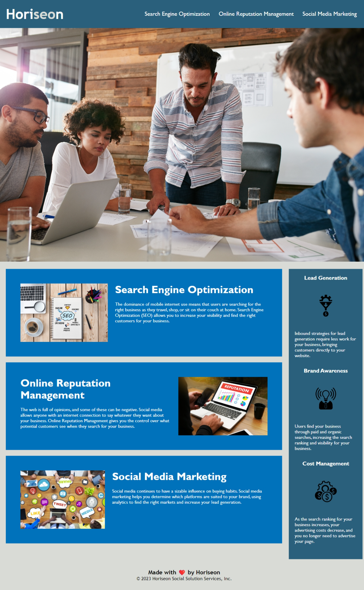

# Challenge 01 submission

## Overview

### `User Story:` 
AS A marketing agency

I WANT a codebase that follows accessiblity standards

SO THAT our own site is optimized for search engines 

### `Acceptance Criteria:`
* GIVEN a webpage meets accessibility standards
* WHEN I view the source code
* THEN I find semantic HTML elements
* WHEN I view the structure of the HTML elements
* THEN I find that the elements follow a logical structure independent of styling and positioning
* WHEN I view the image elements
* THEN I find accessible alt attributes
* WHEN I view the heading attributes
* THEN they fall in sequential order
* WHEN I view the title element
* THEN I find a concise, descriptive title

### `Actual Behavior:`

Refactoring style.css and index.html with semantic html which follow a logical structure independent of styling and positioning. Changed the css to fit the semantic elements, webpage meets accessibility standards. 

## Assets

The screenshot demonstrates the web application's appearance.

## Links

* Live URL: https://github.com/ASHLOUISE/challenge-1.git
* Github: git@github.com:ASHLOUISE/challenge-1.git